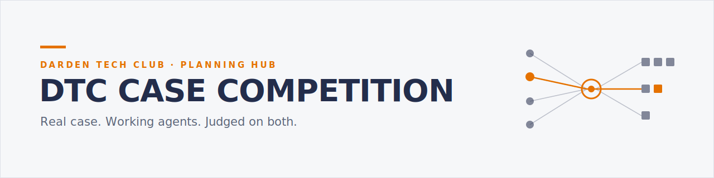

<picture>
  <source media="(prefers-color-scheme: dark)" srcset="assets/banner-dark.svg">
  
</picture>

# DTC Case Competition — Planning Hub

Working planning materials for a prospective **Darden Tech Club case competition**: a marketing case that teams complete *with* AI — not AI-assisted slides, but working agents doing real marketing work, judged alongside the business recommendation.

> **Status: working draft (v0.1, July 2026).** These are planning documents for discussion, not an official DTC publication. Sponsorship, dates, and format are all under discussion and subject to change.

## Why this format

Case competitions test business judgment; hackathons test what you can ship. Until recently MBAs couldn't realistically do both in one event — agentic AI tooling changed that. This competition asks teams to deliver a real marketing recommendation **and** a working AI artifact behind it, which makes it (to our knowledge) a genuinely differentiated format among MBA programs — and a far better story for a sponsor than a logo on a slide.

Precedent on Grounds: the Batten Institute's inaugural **Tech Innovators Challenge** (spring 2026) — Darden's first tech-focused case competition, with real company partners and solutions that went on to real pilots.

## Document map

| Doc | What it covers |
|---|---|
| [case/concepts.md](case/concepts.md) | Four candidate case concepts, with a recommendation |
| [case/spec.md](case/spec.md) | What teams must actually ship — three feasibility tiers |
| [case/rubric.md](case/rubric.md) | Judging rubric with an explicit AI-leverage dimension |
| [case/event-format.md](case/event-format.md) | Event skeleton, sponsor touchpoints, open decisions |
| [event-ops/agentic-ops.md](event-ops/agentic-ops.md) | Menu of agent-run event operations, with effort estimates |
| [sponsor/prospectus.md](sponsor/prospectus.md) | One-page sponsor prospectus — built to be forwarded |

## How to use this repo

- Everything is a draft meant to be argued with — open an issue or edit directly.
- Specs carry a version header; AI tooling moves fast enough that all assumptions should be re-checked ~4 weeks before launch.
- Built and maintained with agentic coding tools, in the spirit of the event itself.
